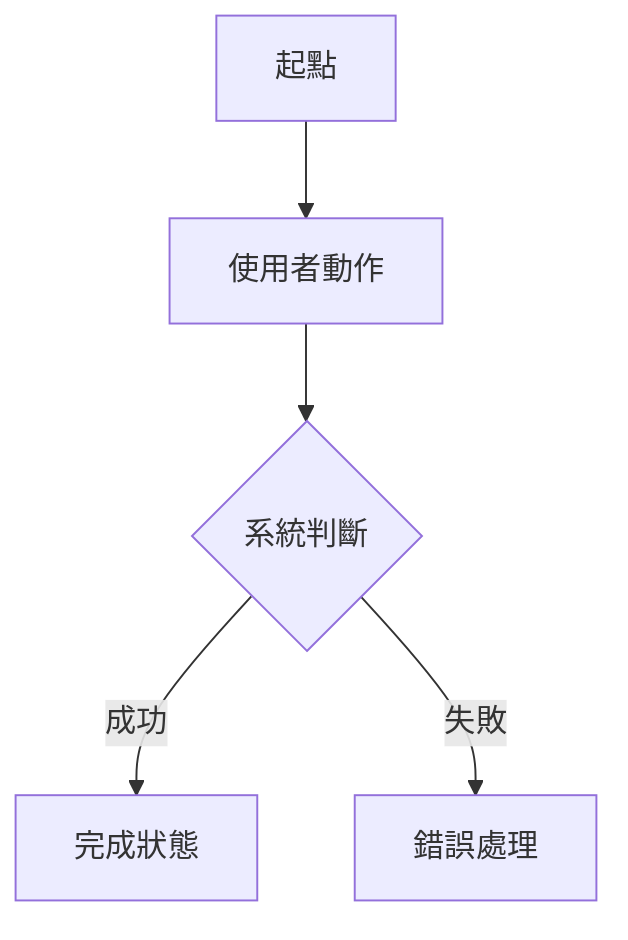

# 06 FLOWS AND STATES

這份文件把功能從「頁面」拆成「流程」與「狀態」。

## 核心流程模板

### Flow: 待填

- 目的：
- 使用者角色：
- 起點：
- 結束狀態：
- 成功條件：
- 失敗條件：

步驟：

1. 使用者：
   - 動作：
   - 系統判斷：
   - 寫入資料：
   - 權限檢查：
   - 錯誤處理：

## 狀態機模板

### Entity: 待填

| 狀態 | 意義 | 可由誰改變 | 下一狀態 | 禁止轉移 |
|---|---|---|---|---|
| 待填 | 待填 | 待填 | 待填 | 待填 |

## 流程圖

可用 Mermaid。

