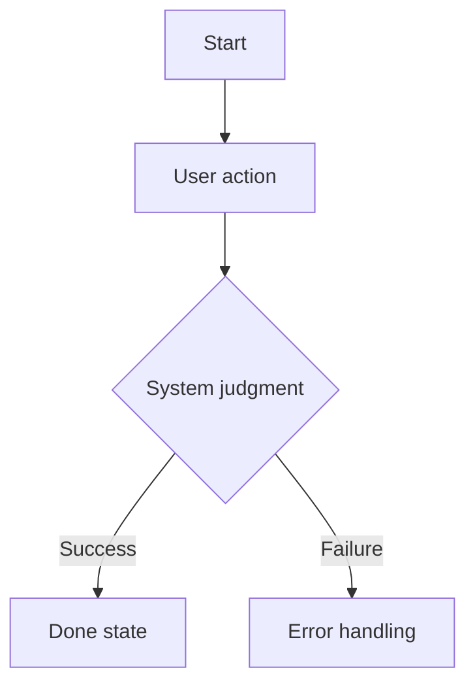

# 06 FLOWS AND STATES

This document breaks functionality from "pages" into "flows" and "states."

## Core Flow Template

### Flow: To be filled

- Purpose:
- User role:
- Start point:
- End state:
- Success condition:
- Failure condition:

Steps:

1. User:
   - Action:
   - System judgment:
   - Data written:
   - Permission check:
   - Error handling:

## State Machine Template

### Entity: To be filled

| State | Meaning | Who Can Change It | Next State | Forbidden Transition |
|---|---|---|---|---|
| To be filled | To be filled | To be filled | To be filled | To be filled |

## Flow Diagram

Mermaid can be used.

